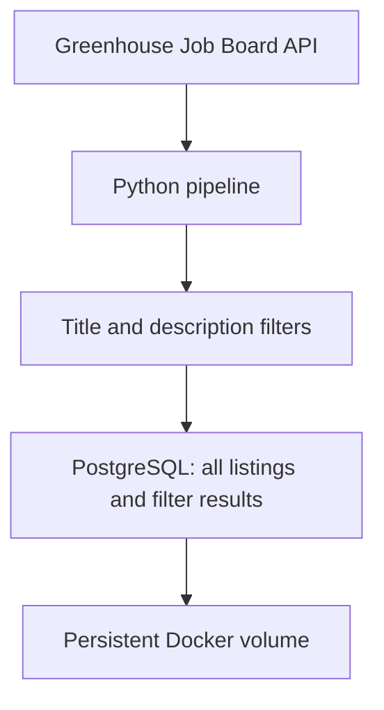

# Job Radar

A personal job monitoring project focused on data engineering opportunities at fintech and software product companies.

Job Radar retrieves public job listings, applies rule-based relevance filters, and stores the results in PostgreSQL. The pipeline runs in Docker and can be executed locally through Docker Compose.

**Status: ingestion, filtering, PostgreSQL persistence, a web interface, hosted PostgreSQL, and production deployment are implemented. Scheduled execution and notifications are not implemented yet.**

## Why this project?

Searching across multiple company career pages is repetitive. This project aims to bring relevant opportunities into one place while demonstrating an end-to-end data engineering workflow:

- Extract data from external APIs.
- Evaluate job relevance using titles and descriptions.
- Store and update records without creating duplicates.
- Run the application in a reproducible container environment.
- Track development through Git and GitHub.

The intended audience is a candidate looking for junior, mid-level, or unspecified-level data engineering roles.

## Current capabilities

- Retrieve job listings and descriptions from the Greenhouse Job Board API.
- Query Typeform, N26, and Datadog.
- Evaluate titles and descriptions using transparent, rule-based filters.
- Separate potential matches from jobs requiring further review.
- Store all retrieved listings, including those excluded by the filter.
- Update existing records using PostgreSQL upserts.
- Preserve the first observation timestamp and refresh the last observation timestamp.
- Persist database data in a Docker volume.
- Run the pipeline manually through Docker Compose.

A successful source response with zero matches is a valid result. A failed request is reported as an error, not as an empty job board.

## Technology stack

| Technology | Purpose |
| --- | --- |
| Python 3.12 | API requests, filtering, and pipeline execution |
| Python standard library | HTTP requests, JSON parsing, HTML text extraction, and regular expressions |
| Psycopg 3 | PostgreSQL connection and SQL execution |
| PostgreSQL 17 | Persistent storage and conflict-based updates |
| Docker | Containerized Python and database environments |
| Docker Compose | Service configuration, networking, health checks, and volumes |
| Git and GitHub | Version control and source hosting |
| Next.js, React, and TypeScript | Server-rendered web interface |
| Tailwind CSS | Interface styling |
| Node.js and node-postgres (pg) | Web runtime and server-side database queries |
| Neon PostgreSQL | Managed cloud PostgreSQL database |
| Vercel | Production hosting for the Next.js application |
| Windows with WSL 2 / Ubuntu | Current local development environment |

The current implementation does not use an LLM, embeddings, or a paid job data API.

## Architecture



The base Compose file defines two services. `compose.web.yaml` adds the web service:

- `db`: PostgreSQL, with a health check and persistent storage.
- `pipeline`: the Python application, which waits for the database to become healthy.

The pipeline connects to PostgreSQL using the service name `db`. The current Compose configuration does not publish the database port to the host.

## Data sources

| Company | Source | Integration status |
| --- | --- | --- |
| Typeform | Greenhouse | Implemented |
| N26 | Greenhouse | Implemented |
| Datadog | Greenhouse | Implemented |
| Pleo | Ashby | Investigated; HTTP 403 received, not integrated |
| TravelPerk / Perk | Pending verification | Initial Greenhouse endpoints returned HTTP 404; not integrated |
| Revolut | Pending verification | Not integrated |
| Wise | Pending verification | Not integrated |
| Factorial | Pending verification | Not integrated |

Job availability changes over time. Integration support does not imply that suitable openings currently exist.

## How filtering works

The filter uses combinations of words rather than a fixed list of complete job titles.

A listing may be retained when:

1. Its title combines an engineering or development term with a data-related term.
2. Its title is technical and its description contains at least two configured groups of data engineering signals.

Description signals include data pipelines, ETL/ELT, data ingestion, warehouses or lakes, data modeling, and batch or stream processing.

Explicit seniority terms in the title, such as Senior, Staff, Principal, Lead, Manager, or Director, are excluded. Certain advanced numeric grades are also excluded.

Selected listings receive one of two labels:

- **Candidata:** a data-related technical title with an explicit initial or intermediate level marker.
- **Por revisar:** a potentially relevant role with an ambiguous title or unspecified level.

These labels indicate preliminary relevance, not confirmed suitability.

### Filtering limitations

- Keywords can produce false positives and false negatives.
- Seniority terminology differs between companies.
- Required years of experience are not yet evaluated.
- Spain eligibility and remote-work restrictions are not yet evaluated.
- Salary and technology requirements are not yet extracted into dedicated fields.
- A mention of relevant work in a description does not prove that it is the main responsibility.

The filter is a first screening step, not a replacement for reading the job description.

## Database model

The `jobs` table stores:

| Column | Meaning |
| --- | --- |
| `source` | Source platform, currently `greenhouse` |
| `source_job_id` | Job identifier provided by the source |
| `company` | Company name |
| `title` | Job title |
| `location` | Location text supplied by the source |
| `url` | Original listing URL |
| `description` | Normalized description text |
| `selected` | Whether the listing passes the current filter |
| `match_status` | Preliminary match label |
| `match_reason` | Filter reason and level assessment |
| `first_seen_at` | First time the pipeline stored the listing |
| `last_seen_at` | Most recent successful observation |

The primary key is `(source, source_job_id)`.

`INSERT ... ON CONFLICT DO UPDATE` refreshes existing records without changing `first_seen_at`. Each company's write is performed in a transaction.

Observation timestamps are not publication dates. Listings that disappear from a source are currently retained; closed-job detection is not implemented.

## Repository structure

```text
job-radar/
├── main.py
├── requirements.txt
├── Dockerfile
├── compose.yaml
├── sql/
│   └── 001_create_jobs.sql
├── .gitignore
├── .dockerignore
└── README.md
```

A local `.env` file supplies database credentials and is excluded from Git.

## Run locally

### Prerequisites

- Git
- Docker with Docker Compose
- On Windows: WSL 2 with Docker Desktop integration enabled for Ubuntu
- OpenSSL for the credential-generation command below

Run the following commands in Ubuntu / Bash.

### 1. Clone the repository

```bash
git clone https://github.com/jorgearcenic7/job-radar.git
cd job-radar
```

### 2. Create local configuration

This creates `.env` only if it does not already exist:

```bash
if [ -e .env ]; then
  echo ".env already exists; leaving it unchanged."
else
  (
    umask 077
    printf 'POSTGRES_DB=job_radar\nPOSTGRES_USER=job_radar\nPOSTGRES_PASSWORD=%s\n' \
      "$(openssl rand -hex 24)" > .env
  )
fi
```

Never commit `.env` or database credentials.

The database user and database name above are used by the setup commands below. Changing the password in `.env` does not automatically change the password in an already initialized database volume.

### 3. Start PostgreSQL

```bash
docker compose up -d --wait db
```

### 4. Create the table

```bash
docker compose exec -T db psql \
  -U job_radar \
  -d job_radar \
  -v ON_ERROR_STOP=1 \
  < sql/001_create_jobs.sql
```

The table definition uses `CREATE TABLE IF NOT EXISTS`. It is safe to rerun, but it is not a migration system for future schema changes.

### 5. Build and run the pipeline

```bash
docker compose build pipeline
docker compose run --rm pipeline
```

Rebuild the image after changing Python code or dependencies.

### 6. Inspect stored results

```bash
docker compose exec -T db psql -U job_radar -d job_radar -c "
SELECT
    company,
    COUNT(*) AS total,
    COUNT(*) FILTER (WHERE selected) AS selected
FROM jobs
GROUP BY company
ORDER BY company;
"
```

### 7. Stop the services

```bash
docker compose down
```

The database volume remains available for the next run. Adding `-v` deletes the Compose volumes, including the stored database data.

## Validation performed

- Executed a Python application inside Docker.
- Retrieved real listings from three Greenhouse boards.
- Checked ten synthetic examples covering accepted and excluded roles.
- Verified connectivity between the Python and PostgreSQL containers.
- Stored 526 listings in an initial local run.
- Repeated ingestion and confirmed that the stored count remained 526.

The listing count is a historical development observation, not an expected fixed result.

The ten filtering examples were run manually and are not yet committed as an automated test suite. No-match results do not establish that the filter has perfect coverage.

## Current operational limits

- Runs are triggered manually.
- No automatic retries or backoff are implemented.
- No persistent execution history or alerting exists yet.
- Source failures cause the pipeline to finish unsuccessfully.
- Successful companies may already be committed when another source fails.
- Web results are limited to 100 per query; pagination is not implemented.
- There is no automatic daily schedule.
- There are no email notifications.
- There is no closed-listing detection.

## Roadmap

- [x] Configure Docker and the local development environment.
- [x] Publish the source code on GitHub.
- [x] Retrieve real job listings.
- [x] Add initial title and description filters.
- [x] Store listings in PostgreSQL.
- [x] Verify repeat ingestion without duplicates.
- [ ] Commit automated tests for filtering and persistence.
- [ ] Evaluate location eligibility for Spain.
- [x] Add a local web interface for browsing and filtering listings.
- [x] Configure a hosted PostgreSQL database with Neon.
- [x] Deploy the web application on Vercel.
- [ ] Schedule the Docker pipeline through GitHub Actions.
- [ ] Add further company integrations where feasible.
- [ ] Consider email notifications as a later enhancement.

The first deployable version is complete when listings update automatically without the developer's computer running and can be viewed through the deployed web application.

## Documentation maintenance

Update this README in the same commit as each functional change.

Keep implemented capabilities, source coverage, setup instructions, validation evidence, known limitations, and the roadmap aligned with the code. Planned features must remain clearly marked until implemented.

## References

- [Greenhouse Job Board API](https://developers.greenhouse.io/job-board.html)
- [Psycopg documentation](https://www.psycopg.org/psycopg3/docs/)
- [Docker Compose documentation](https://docs.docker.com/compose/)
- [PostgreSQL documentation](https://www.postgresql.org/docs/17/)

## Local web interface

The Next.js application lives in `web/`. It reads PostgreSQL directly
from server-side code using `pg`. Database credentials are supplied through
environment variables and are not sent to the browser.

Implemented features:

- Global counters for stored listings, preliminary matches, and companies.
- Case-insensitive title search.
- Company selection.
- An option to show only preliminary matches.
- Links to the original job listings.
- An empty-results message.
- Up to 100 results per query, ordered by company and title.

Counters represent the complete database, not the filtered results.
The current page has been checked manually in the browser.
Automated browser tests have not been added.

### Additional project files

- `web/`: Next.js application and its npm lockfile.
- `web/src/app/page.tsx`: server-rendered listing page and filters.
- `web/src/app/globals.css`: interface styles.
- `web/src/lib/db.ts`: server-only PostgreSQL connection pool.
- `compose.web.yaml`: local web service configuration.

### Install web dependencies

From the repository root, in Ubuntu / Bash:

```bash
docker run --rm \
  --user "$(id -u):$(id -g)" \
  -e npm_config_cache=/tmp/npm-cache \
  -v "$PWD/web:/app" \
  -w /app \
  node:24-bookworm-slim npm ci

```

## Cloud deployment

Job Radar is now deployed in production:

**Production URL:** https://job-radar-snowy.vercel.app

The production architecture uses:

- Vercel to host the Next.js web application.
- Neon as the managed PostgreSQL database.
- `DATABASE_URL` as the server-side database connection variable.
- GitHub as the source code repository.
- Docker and Docker Compose for the local development environment.

The local `jobs` table was migrated to Neon and the production deployment
was manually verified to load the stored job listings successfully.

Database credentials and connection strings are stored as environment
variables and are not committed to the repository.

Current cloud flow:

GitHub source code → Vercel / Next.js → Neon PostgreSQL

The ingestion pipeline still runs manually. Automated scheduled execution
through GitHub Actions is the next infrastructure milestone.
