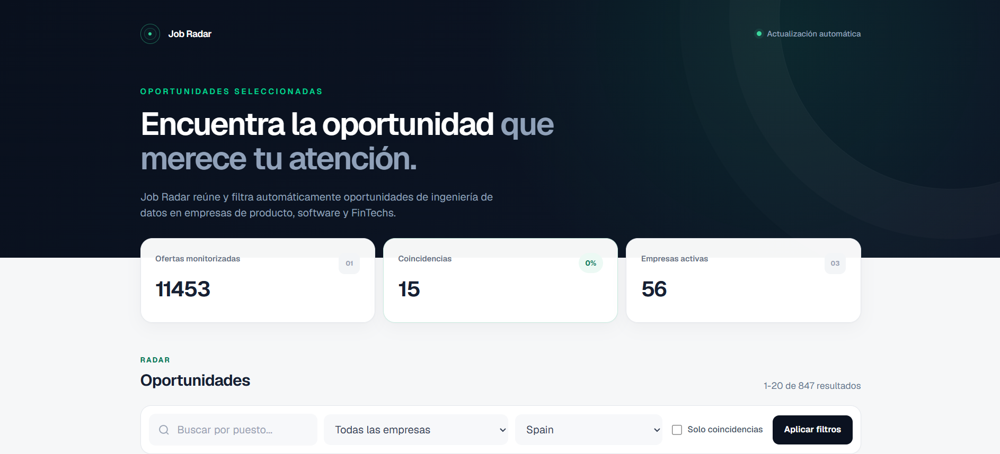
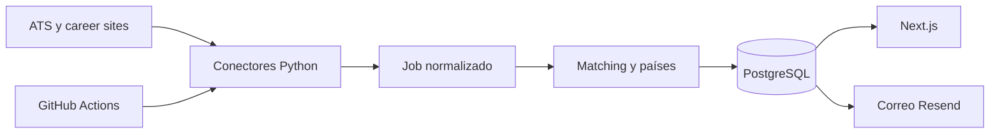

# Job Radar

Job Radar agrega ofertas de Data Engineering directamente desde career sites,
las normaliza, aplica reglas de matching explícitas y mantiene su ciclo de vida
en PostgreSQL. El resultado se consulta en una aplicación web y puede enviarse
por correo al terminar cada ingesta.

### [Abrir la demo →](https://job-radar-snowy.vercel.app)



[](https://github.com/jorgearcenic7/job-radar/actions/workflows/tests.yml)
[](https://github.com/jorgearcenic7/job-radar/actions/workflows/codeql.yml)
[](LICENSE)

[Arquitectura](docs/ARCHITECTURE.md) ·
[Conectores](docs/CONNECTORS.md) ·
[Operación](docs/OPERATIONS.md) ·
[Contribuir](CONTRIBUTING.md) ·
[Seguridad](SECURITY.md)

## Qué problema resuelve

Buscar oportunidades junior o intermedias exige revisar portales con formatos
distintos, detectar duplicados y volver a comprobar si una oferta continúa
abierta. Job Radar automatiza ese trabajo sin ocultar la decisión:

- consulta **70 fuentes empresa/ATS** configuradas en código;
- convierte cada publicación a un modelo `Job` común;
- extrae únicamente salario y experiencia realmente publicados;
- clasifica oportunidades como `Buena coincidencia`, `Stretch` o fuera de
  objetivo mediante reglas auditables;
- conserva ofertas nuevas, actualizadas, cerradas y reactivadas;
- evita cierres masivos cuando un ATS devuelve un snapshot vacío o anómalo;
- registra métricas por ingesta y por fuente;
- publica solo ofertas activas en una web con búsqueda y filtros.

## Arquitectura y flujo


```mermaid
flowchart LR
    A[ATS y career sites] --> B[Conectores Python]
    B --> C[Job normalizado]
    C --> D[Matching y países]
    D --> E[(PostgreSQL)]
    E --> F[Next.js]
    E --> G[Correo Resend]
    H[GitHub Actions] --> B
```

`main.py` solo delega en el orquestador. En cada ejecución:

1. `job_radar/connectors/registry.py` entrega los conectores en orden.
2. Cada conector obtiene un snapshot y devuelve objetos `Job`.
3. El orquestador evalúa la salud del snapshot usando ejecuciones anteriores.
4. `save_jobs()` clasifica y hace upsert por `(source, source_job_id)`.
5. Las ofertas ausentes se cierran solo si el snapshot permite cierres; un
   upsert posterior reactiva una oferta cerrada.
6. `ingestion_runs` y `source_runs` conservan estado, duración, recuentos y
   errores.
7. Al finalizar se intenta enviar por Resend el listado de coincidencias
   activas.

La explicación completa está en [docs/ARCHITECTURE.md](docs/ARCHITECTURE.md).

## Fuentes configuradas

La tabla procede de `job_radar/connectors/registry.py`, que es la fuente de
verdad. Una empresa puede no tener ofertas activas aunque su integración siga
siendo válida.

| Tipo | Cantidad | Empresas |
| --- | ---: | --- |
| Greenhouse | 28 | Typeform, N26, Stripe, Adyen, Block (incl. Afterpay), Chime, Nubank, Robinhood, SoFi, Coinbase, Datadog, Clarity AI, Fever, Cabify, Aircall, Auctane, Celonis, Taxbit, Ebury, Lynx, Monzo, Make, Awin, Blip Global, OneTrust, nCino, Affirm, Raisin |
| Ashby | 16 | Pleo, Plaid, Qonto, Mollie, Capchase, Invopop, Airwallex, Checkout.com, Rain, Lovable, n8n, ClickHouse, Ashby, StackAI, Camunda, Supabase |
| Workday | 5 | Mastercard, BBVA, Santander, Amadeus, AVEVA |
| SmartRecruiters | 3 | IFS, Wise, Grab / Grab Financial Group |
| SuccessFactors | 2 | SAP, Hexagon |
| Lever | 1 | Paytm |
| Deel Jobs | 1 | Klarna |
| BambooHR | 1 | Flutterwave |
| Eightfold | 1 | PayPal |
| Teamtailor | 3 | Spendesk, Seedtag, Lingokids |
| Comeet | 1 | ThetaRay |
| iCIMS | 1 | Mambu |
| Sage People | 1 | Sage |
| Portales propios | 6 | Ant Group / Ant International, Deel, Revolut, CaixaBank Tech, Dassault Systèmes, Visma |

Los conectores reutilizables y los portales personalizados se documentan en
[docs/CONNECTORS.md](docs/CONNECTORS.md).

## Matching y extracción

Las reglas viven en `job_radar/matching/rules.py` y están orientadas a un
perfil de Data Engineering con aproximadamente un año de experiencia:

- priorizan Data Engineer, Analytics Engineer, Data Platform,
  Data Infrastructure, Data Warehouse, ETL/ELT, DataOps y BI Engineer;
- aceptan como `Stretch` roles técnicos adyacentes si la descripción contiene
  suficientes señales de datos;
- descartan prácticas, graduate/trainee, seniority alto, niveles IV o
  superiores y requisitos mínimos de cuatro o más años;
- aceptan ubicaciones españolas y remoto sin restricción, o remoto abierto a
  Europa/EMEA; rechazan remotos restringidos a otras regiones conocidas;
- conservan la ubicación original y derivan `countries` con
  `geonamescache`.

El extractor de salario exige una moneda (`€`, `$`, `£`, EUR, USD o GBP),
acepta moneda antes o después, sufijos `k/K`, rangos y periodos publicados. El
extractor de experiencia reconoce expresiones inglesas y españolas y filtra
menciones que describen la antigüedad de la empresa. Ambos devuelven texto de
la fuente: no calculan ni normalizan una cifra inexistente.

## Lifecycle, snapshots y observabilidad

La clave primaria de `jobs` es `(source, source_job_id)`. Cada oferta mantiene
`first_seen_at`, `last_seen_at`, `active` y `closed_at`; reaparecer en un
snapshot actualiza los datos, marca `active = TRUE` y limpia `closed_at`.

Antes de cerrar ausentes, `job_radar/orchestration/snapshots.py` compara el recuento con
el historial reciente. Los snapshots vacíos siempre suprimen cierres. Una
caída grande respecto a una línea base suficiente se marca `suspicious` y
también suprime cierres hasta que el nuevo nivel se estabiliza. Las ofertas sí
recibidas se actualizan aun cuando los cierres estén suprimidos.

Cada pipeline crea una fila en `ingestion_runs` y una por fuente en
`source_runs`. Se guardan estados, tiempos, ofertas vistas/nuevas/cerradas,
matches, salud del snapshot y errores. Los logs replican esas métricas con
`run_id` y `source_run_id`.

## Web y notificaciones

La aplicación `web/` es un Server Component dinámico de Next.js. Consulta
PostgreSQL desde el servidor, muestra solo ofertas activas y ofrece búsqueda
por título, empresa, país, coincidencias y paginación de 20 resultados. España
es el filtro inicial.

La web exige `WEB_DATABASE_URL` en Vercel; fuera de Vercel admite
`DATABASE_URL` como alternativa. El código no puede garantizar los privilegios
del rol: usar una credencial con solo `SELECT` para la web es una obligación
operativa, no una propiedad impuesta por la aplicación.

Si `RESEND_API_KEY` está configurada, la ingesta envía un correo HTML y texto
plano a `NOTIFICATION_EMAIL`. Incluye todas las coincidencias activas. Los
fallos de fuentes requeridas marcan el resumen como parcial y
`NOTIFICATION_RUN_ID` se usa como clave de idempotencia cuando existe.

## Ejecución automática

`.github/workflows/job-radar.yml` permite ejecución manual y programa el cron
`0 6 */2 * *` con timezone `Europe/Madrid`: se ejecuta a las 06:00 en los días
del mes seleccionados por `*/2`. El workflow construye la imagen Docker,
comprueba los secretos obligatorios y ejecuta el contenedor sin privilegios,
con filesystem de solo lectura y `/tmp` temporal.

Consulta estados, diagnóstico y configuración operativa en
[docs/OPERATIONS.md](docs/OPERATIONS.md).

## Stack verificado

| Capa | Tecnología fijada o usada por el repo |
| --- | --- |
| Pipeline | Python 3.12, Psycopg 3.3.6, curl_cffi 0.16.3, geonamescache 3.0.2 |
| Datos | PostgreSQL 17 en Compose y CI; SQL versionado en `sql/` |
| Web | Next.js 16.3.8, React 19.3.0, TypeScript 5.9.3, Tailwind CSS 4.3.3, node-postgres 8.23.0 |
| Automatización | Docker, GitHub Actions, Dependabot, CodeQL y Dependency Review |
| Despliegue web | Vercel-compatible; la demo enlazada usa un dominio `vercel.app` |

CI y `compose.web.yaml` usan Node.js 24. El repositorio no contiene la
configuración de los recursos externos de Neon, Resend o Vercel; únicamente su
integración mediante variables de entorno.

## Desarrollo local

### Requisitos

- Python 3.12.
- PostgreSQL 17 o una instancia compatible.
- Node.js 24 y npm para `web/`.
- Docker y Docker Compose, opcionales.

### Pipeline y base de datos

```bash
python3 -m venv .venv
source .venv/bin/activate
python3 -m pip install -r requirements.txt
cp .env.example .env
```

Crea una base y aplica las migraciones en orden:

```bash
psql "$DATABASE_URL" < sql/001_create_jobs.sql
psql "$DATABASE_URL" < sql/002_add_job_lifecycle.sql
psql "$DATABASE_URL" < sql/003_add_ingestion_observability.sql
psql "$DATABASE_URL" < sql/004_add_snapshot_health.sql
python3 main.py
```

Con Docker Compose:

```bash
docker compose up -d db
docker compose exec -T db sh -c 'psql -U "$POSTGRES_USER" -d "$POSTGRES_DB"' < sql/001_create_jobs.sql
docker compose exec -T db sh -c 'psql -U "$POSTGRES_USER" -d "$POSTGRES_DB"' < sql/002_add_job_lifecycle.sql
docker compose exec -T db sh -c 'psql -U "$POSTGRES_USER" -d "$POSTGRES_DB"' < sql/003_add_ingestion_observability.sql
docker compose exec -T db sh -c 'psql -U "$POSTGRES_USER" -d "$POSTGRES_DB"' < sql/004_add_snapshot_health.sql
docker compose run --rm pipeline
```

### Aplicación web

```bash
cp web/.env.example web/.env.local
cd web
npm ci
npm run dev
```

Abre <http://localhost:3000>. La guía específica está en
[web/README.md](web/README.md).

## Tests y CI

Validación Python local:

```bash
python3 -m pip install -r requirements.txt -r requirements-dev.txt
python3 -m pip check
python3 -m pip_audit -r requirements.txt --strict
python3 -m compileall -q main.py job_radar tests
python3 -m unittest discover -s tests -v
```

Las pruebas PostgreSQL usan `TEST_DATABASE_URL`; si no está configurada se
omiten localmente. CI levanta PostgreSQL 17 y las ejecuta.

Validación web equivalente a los checks obligatorios:

```bash
cd web
npm ci
npm audit --omit=dev --audit-level=high
npm audit --audit-level=high || true
npm run lint
npm run build
```

El audit npm completo es informativo en CI; el audit de dependencias de
producción es el que bloquea. CI también ejecuta CodeQL para Python y
JavaScript/TypeScript y Dependency Review en pull requests.

## Seguridad

El código usa consultas parametrizadas, restringe enlaces externos a HTTPS,
acota filtros y paginación, aplica timeouts de PostgreSQL y envía una CSP con
nonce desde `web/src/proxy.ts`. `web/next.config.ts` añade cabeceras HSTS,
anti-framing, MIME sniffing, referrer y permissions policy. Los workflows
tienen permisos explícitos mínimos y acciones fijadas por SHA.

Algunos controles dependen de la operación: privilegios del rol de base de
datos, protección de ramas, configuración de Vercel/Neon, rotación de secretos
y opciones de seguridad de GitHub no pueden demostrarse solo desde este repo.
La separación se explica en [SECURITY.md](SECURITY.md).

## Limitaciones reales

- El matching es heurístico y requiere revisión humana.
- Los ATS y career sites son dependencias externas; pueden cambiar contratos,
  bloquear tráfico o estar temporalmente indisponibles.
- Los conectores personalizados dependen de HTML o APIs no siempre estables.
- No existe migrador automático: los SQL se aplican explícitamente en orden.
- El repositorio no aprovisiona PostgreSQL, Neon, Resend ni Vercel.
- Python fija dependencias directas, pero no mantiene un lockfile transitivo
  con hashes.

## Documentación

- [Arquitectura y modelo de ejecución](docs/ARCHITECTURE.md)
- [Catálogo y guía de conectores](docs/CONNECTORS.md)
- [Operación y diagnóstico](docs/OPERATIONS.md)
- [Contribución](CONTRIBUTING.md)
- [Política de seguridad](SECURITY.md)
- [Auditoría histórica del 22-09-2026](docs/security-audit-2026-09-22.md)
- [Instrucciones para agentes](AGENTS.md)

## Licencia

Distribuido bajo la [Apache License 2.0](LICENSE). Consulta [NOTICE](NOTICE)
para la atribución del proyecto.
